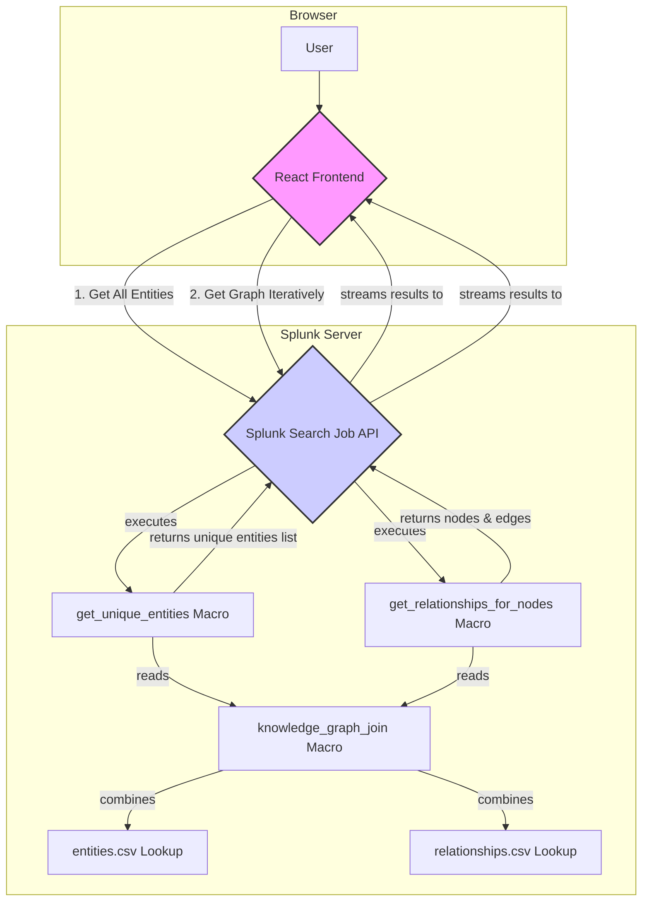

# Knowledge Mapper - Technical Architecture

This document provides a technical overview of the Knowledge Mapper Splunk application, detailing its components and the flow of data through the system.

## System Diagram

The following diagram illustrates the high-level architecture, showing how the frontend iteratively fetches data from the Splunk backend.

## Component Breakdown

### 1. Frontend (React Application)

*   **Location:** `packages/knowledge-mapper/src/main/webapp/`
*   **Framework:** Built with [React](https://reactjs.org/) and [TypeScript](https://www.typescriptlang.org/).
*   **UI Components:** Uses Splunk's official [`@splunk/react-ui`](https://splunkui.splunk.com/Packages/react-ui) library for a native Splunk look and feel.
*   **State Management:** Utilizes standard React hooks (`useState`, `useEffect`, `useCallback`) for state management.
*   **Graph Visualization:** The network graph is rendered using the [Vis.js](https://visjs.org/) library.
*   **Backend Communication:** The app uses a client-driven, iterative approach. It communicates with the Splunk backend via the `@splunk/search-job` library to run a series of simple, targeted searches, which is more performant for large datasets than a single, complex, recursive search.

### 2. Backend (Splunk Objects)

*   **Location:** `packages/knowledge-mapper/src/main/resources/splunk/default/`
*   **Core Logic:** The application's logic is defined in a set of efficient, targeted SPL macros rather than a single monolithic one. This allows for a more interactive user experience.
*   **`macros.conf`:**
    *   `knowledge_graph_join`: A simple, non-parameterized macro that uses `lookup` commands to join the `entities` and `relationships` lookups. This forms the base data set for all other queries.
    *   `get_unique_entities`: A macro that returns a complete list of all unique entities from the knowledge graph. This is used to populate the dropdown lists in the UI, allowing users to select a starting point.
    *   `get_relationships_for_nodes(nodes)`: A parameterized macro that takes a comma-separated list of node IDs. It returns all of those nodes and any relationships that connect them. This is the core of the iterative fetching mechanism.
*   **`transforms.conf`:** Defines the `entities` and `relationships` lookups, pointing to the `entities.csv` and `relationships.csv` files.
*   **`app.conf` & `nav.xml`:** These files handle the basic app setup, configuration, and navigation structure.

## Data Flow: Iterative Graph Exploration

The application now uses an iterative process to build the graph, which keeps the UI fast and responsive.

1.  **Initial Load:**
    *   When the "Entity Explorer" page loads, the frontend immediately calls the `get_unique_entities` macro.
    *   The backend returns a list of all entities (e.g., "Alice", "Bob", "SystemA").
    *   The frontend populates the entity selection dropdown with this list. The first entity is selected by default.
2.  **First-Degree Exploration (Iteration 1):**
    *   Using the default selected entity (e.g., "Alice"), the frontend calls the `get_relationships_for_nodes(nodes="1")` macro.
    *   The backend returns the data for "Alice" and any nodes directly connected to her (e.g., "Laptop1", "SystemA") along with the edges connecting them.
    *   The frontend renders this initial graph.
3.  **Second-Degree Expansion (Iteration 2):**
    *   When the user increases the "Degrees" slider to 2, the frontend gathers the IDs of all the *new* nodes from the last iteration (e.g., "Laptop1", "SystemA").
    *   It then calls `get_relationships_for_nodes(nodes="7,4")`.
    *   The backend returns the relationships for "Laptop1" and "SystemA".
    *   The frontend merges this new data with the existing graph and re-renders.
4.  **Further Expansion:** This process repeats for each degree of separation the user requests, with the client managing the expansion logic and making targeted calls for only the required data.

## Data Contract: Backend to Frontend

For the UI to correctly render the graph and display details, the backend macros must return fields with the following names.

### Node Data

| Field Name | Type | Description | Required | Example |
| :--- | :--- | :--- | :--- | :--- |
| `id` | string | Unique identifier for the entity. | **Yes** | `"1"` |
| `label` | string | The display name of the node in the graph. | **Yes** | `"Alice"` |
| `group` | string | The entity type, used for coloring and filtering. | **Yes** | `"user"` |
| `title` | string | The hover-text for the node (tooltip). Often same as label. | **Yes** | `"Alice"` |
| `description` | string | Detailed information for the details panel. Can be a JSON string. | No | `"{'role': 'Admin'}"` |
| `isAnomaly` | boolean | A flag to indicate if the node is an anomaly (gets highlighted). | No | `true` |

### Edge Data

| Field Name | Type | Description | Required | Example |
| :--- | :--- | :--- | :--- | :--- |
| `from` | string | The `id` of the source node. | **Yes** | `"1"` |
| `to` | string | The `id` of the target node. | **Yes** | `"4"` |
| `label` | string | The display text for the relationship edge. | **Yes** | `"uses"` |
| `arrows`| string | Specifies the direction of the arrow. Must be `"to"`. | **Yes** | `"to"` | 